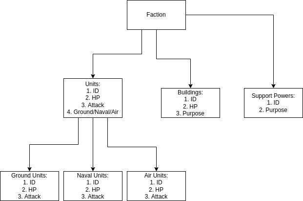

# Subjugate
This is a website from the fictional Blind Games Studio, a game company that is making a fictional RTS game called "Subjugate". The website showcases the incomplete game, by showing the units, buildings, and support powers of one of the game's factions.

## Purpose:
Subjugate is practice for the creation of video game websites to show off their upcoming products to generate interest.

## Technologies:
This website utilizes the three front end languages of HTML, CSS, and JavaScript. It also utilizes EJS, Node.js, and especially SQL databases. The program uses the Model-View-Controller design pattern where different Models are created, commanded in Controllers, and viewed in Views. Various other dependencies are present that where utilized for singular and/or minor utilizations, such as method-override being used to override a few methods in an EJS file. Complicated database relationships between categories of categories and a simple public API of countries, to identify user location, are also utilized for this project.

## Development Approach:
A Pre-Made template that has a functioning authentication system is the starting foundation of the program. From there many models are made to represent the respective factions, units, and other assets inside this hypothetical game that can only be accessed when a user creates an account and logs. The aesthetic of the site involves the user clicks on a faction, then clicks on their entity types, then clicks on the sub-type of said entity. An example path would be to click on a faction, select units, then select ground units to see the ground units. The website has many paths to be opened to reach to the last pages where users can comment on the various assets of the faction.

## Installation:
Type in "npm install" in the terminal upon opening this project, this will install all necessary dependencies to ensure its functionality.

## Unsolved Problems:
Not really a problem, but the aesthetics can be improved to appear more professional and interesting. Albeit the sharpness of appearance has its own charm.

## Code Snippets:
1. groundUnits Model - This is the Model for groundUnits, showcasing the ground units of the "Legions of Tyranny" faction.
~~~js
'use strict';
const {
  Model
} = require('sequelize');
module.exports = (sequelize, DataTypes) => {
  class groundUnits extends Model {
    /**
     * Helper method for defining associations.
     * This method is not a part of Sequelize lifecycle.
     * The `models/index` file will call this method automatically.
     */
    static associate(models) {
      // define association here
      models.groundUnits.belongsTo(models.factionUnits, { foreignKey: 'unitId' });
    }
  };
  groundUnits.init({
    hp: DataTypes.INTEGER,
    attack: DataTypes.INTEGER,
    description: DataTypes.STRING,
    unitId: DataTypes.INTEGER,
    name: DataTypes.STRING,
  }, {
    sequelize,
    modelName: 'groundUnits',
  });
  return groundUnits;
};
~~~

2. groundUnits Migration - Showcasing the migration code of groundUnits
~~~js
'use strict';
module.exports = {
  up: async (queryInterface, Sequelize) => {
    await queryInterface.createTable('groundUnits', {
      id: {
        allowNull: false,
        autoIncrement: true,
        primaryKey: true,
        type: Sequelize.INTEGER
      },
      hp: {
        type: Sequelize.INTEGER
      },
      attack: {
        type: Sequelize.INTEGER
      },
      description: {
        type: Sequelize.STRING
      },
      unitId: {
        type: Sequelize.INTEGER
      },
      createdAt: {
        allowNull: false,
        type: Sequelize.DATE
      },
      updatedAt: {
        allowNull: false,
        type: Sequelize.DATE
      },
      name: {
        type: Sequelize.STRING
      }
    });
  },
  down: async (queryInterface, Sequelize) => {
    await queryInterface.dropTable('groundUnits');
  }
};
~~~

3. groundUnits Controller - The controller of groundUnits, groundComments is nested inside it as the two appear in the same page
~~~js
const express = require('express');
const router = express.Router();
const { groundUnits } = require("../models");
const { groundComments } = require("../models");

// Get Route
router.get('/', function (req, res) {
    groundUnits.findAll()
        .then(function (groundUnitsList) {
            groundComments.findAll()
                .then(function (groundCommentsList) {
                    res.render('groundUnits/index', { groundUnits: groundUnitsList, groundComments: groundCommentsList });
                })
                .catch(function (err) {
                    console.log('ERROR', err);
                    res.json({ message: 'Error occured, please try again....' });
                });
        })
        .catch(function (err) {
            console.log('ERROR', err);
            res.json({ message: 'Error occured, please try again....' });
        });
});

module.exports = router;
~~~

4. groundComments Controller - The afformentioned controller of groundComments which has the ability to be created, read, updated, and deleted, unlike groundUnits.
~~~js
const express = require('express');
const router = express.Router();
const { groundComments } = require("../models");

// Get Routes
router.get('/', function (req, res) {
    groundComments.findAll()
        .then(function (groundCommentsList) {
            res.render('groundComments', { groundComments: groundCommentsList });
        })
        .catch(function (err) {
            console.log('ERROR', err);
            res.json({ message: 'Error occured, please try again....' });
        });
});

// Post Routes
router.post('/', function (req, res) {
    groundComments.create({
        content: req.body.content,
    })
        .then(function (newGroundComment) {
            newGroundComment = newGroundComment.toJSON();
            res.redirect('/groundUnits#comment');
        })
        .catch(function (error) {
            console.log('ERROR', error);
            res.render('404', { message: 'Comment was not added, please try again' });
        });
});

// Edit
router.put('/:id', function (req, res) {
    let groundCommentIndex = Number(req.params.id);
    groundComments.update({
        content: req.body.content,
    }, { where: { id: groundCommentIndex } })
        .then(function (response) {
            console.log('AFTER UPDATE', response);
            res.redirect('/groundUnits#comment');
        })
        .catch(function (error) {
            console.log('ERROR', error);
            res.render('404', { message: 'Update was not successful. Please try again.' });
        });
});

// Delete
router.delete('/:id', function (req, res) {
    let groundCommentIndex = Number(req.params.id);
    groundComments.destroy({ where: { id: groundCommentIndex } })
        .then(function (response) {
            console.log('COMMENT DELETED', response);
            res.redirect('/groundUnits#comment');
        })
        .catch(function (error) {
            console.log('ERROR', error);
            res.render('404', { message: 'Comment was not deleted, please try again....' });
        });
});

module.exports = router;
~~~

5. groundUnits index.ejs - The HTML and Styling of groundUnits tha tutilizes EJS to use the data itself for presentation
~~~html
<!DOCTYPE html>
<html lang="en">

<head>
    <meta charset="utf-8">
    <meta http-equiv="X-UA-Compatible" content="IE=edge">
    <meta name="viewport" content="width=device-width, initial-scale=1">
    <title>Ground Unit Cards</title>
    <link rel="stylesheet" href="https://unpkg.com/bulma@0.9.0/css/bulma.min.css" />
    
    <link rel="stylesheet" href="../css/cards.css">

    

</head>

<body>
    <!-- Navigation Bar -->
    <% if (currentUser) { %>
        <nav class="navbar">
            

                

                    <a class="navbar-item" href="/">
                        
<strong>Subjugate</strong>

                    </a>
                

                

                    

                        <a class="navbar-item" href="/">
                            Home
                        </a>
                        <a class="navbar-item" href="/profile">
                            Profile
                        </a>
                        <a class="navbar-item" href="/auth/logout">
                            Logout
                        </a>
                    

                

            

        </nav>

        <!-- Title -->
        

            

                <h1 class="title" style="color: ghostwhite;" id="mainTitle">Ground Units</h1>
            

        

        <!-- Unit Cards -->
        

            <% let a=groundUnits[0]; %>
                <% a=a.toJSON() %>
                    

                        

                            

                                

                                    

                                        <figure class="image">
                                            
                                        </figure>
                                    

                                    

                                        

                                            

                                                

                                                    <%= a.name %>
                                                

                                            

                                        

                                        

                                            

                                                <%= 'Hitpoints: ' + a.hp %>
                                            

                                            

                                                <%= 'Attack: ' + a.attack %>
                                            

                                            

                                                <%= 'Description: ' + a.description %>
                                            

                                        

                                    

                                

                            

                        

                    

        

        

            <% a=groundUnits[1]; %>
                <% a=a.toJSON() %>
                    

                        

                            

                                

                                    

                                        <figure class="image">
                                            
                                        </figure>
                                    

                                    

                                        

                                            

                                                

                                                    <%= a.name %>
                                                

                                            

                                        

                                        

                                            

                                                <%= 'Hitpoints: ' + a.hp %>
                                            

                                            

                                                <%= 'Attack: ' + a.attack %>
                                            

                                            

                                                <%= 'Description: ' + a.description %>
                                            

                                        

                                    

                                

                            

                        

                    

        

        

            <% a=groundUnits[2]; %>
                <% a=a.toJSON() %>
                    

                        

                            

                                

                                    

                                        <figure class="image">
                                            
                                        </figure>
                                    

                                    

                                        

                                            

                                                

                                                    <%= a.name %>
                                                

                                            

                                        

                                        

                                            

                                                <%= 'Hitpoints: ' + a.hp %>
                                            

                                            

                                                <%= 'Attack: ' + a.attack %>
                                            

                                            

                                                <%= 'Description: ' + a.description %>
                                            

                                        

                                    

                                

                            

                        

                    

        

        

            <% a=groundUnits[3]; %>
                <% a=a.toJSON() %>
                    

                        

                            

                                

                                    

                                        <figure class="image">
                                            
                                        </figure>
                                    

                                    

                                        

                                            

                                                

                                                    <%= a.name %>
                                                

                                            

                                        

                                        

                                            

                                                <%= 'Hitpoints: ' + a.hp %>
                                            

                                            

                                                <%= 'Attack: ' + a.attack %>
                                            

                                            

                                                <%= 'Description: ' + a.description %>
                                            

                                        

                                    

                                

                            

                        

                    

        

        

            <% a=groundUnits[4]; %>
                <% a=a.toJSON() %>
                    

                        

                            

                                

                                    

                                        <figure class="image">
                                            
                                        </figure>
                                    

                                    

                                        

                                            

                                                

                                                    <%= a.name %>
                                                

                                            

                                        

                                        

                                            

                                                <%= 'Hitpoints: ' + a.hp %>
                                            

                                            

                                                <%= 'Attack: ' + a.attack %>
                                            

                                            

                                                <%= 'Description: ' + a.description %>
                                            

                                        

                                    

                                

                            

                        

                    

        

        <!-- Comment System -->
        <form method="POST" action="/groundComments">
            <label for="content">Comment</label>
            <input type="text" name="content">
            <input type="submit" id="comment">
        </form>

        <% for( let index=0; index < groundComments.length; index++ ) { %>
            <% let a=groundComments[index]; %>
                <% a=a.toJSON() %>
                     
                    

                        <%= a.content %>
                    

                    

                        <form method="POST" action="/groundComments/<%= groundComments[index].id %>/?_method=DELETE">
                            <input type="submit" id="deleteButton" value="Delete">
                        </form>
                        <form method="POST" action="/groundComments/<%= groundComments[index].id %>/?_method=PUT">
                            <input type="text" name="content" value="<%= groundComments.content %>">
                            <input type="submit" value="Edit">
                        </form>
                    

                    <% } %>

                        <!-- Footer -->
                        <footer class="footer">
                            

                                

                                    

                                        <a href="#"><i class="fa fa-youtube fa-lg" aria-hidden="true"></i></a>
                                        <a href="#"><i class="fa fa-facebook fa-lg" aria-hidden="true"></i></a>
                                        <a href="#"><i class="fa fa-twitter fa-lg" aria-hidden="true"></i></a>
                                    

                                    

                                        <strong>Subjugate</strong> by <a href="/">Blind Games Studio</a>.
                                    

                                

                            

                        </footer>
                        <% } %>
                            <% if (!currentUser) { %>
                                <h1 id="signUpNow">Please Signup or Login</h1>
                                <% } %>
</body>

</html>
~~~
All the other models, views, controllers, and so forth for the other parts of the program appear nearly identical to the general template that groundUnits and groundComments utilizes.

## Routes
| Route      | Type       | Description   |
| :---        |    :----:   |          ---: |
| /           | GET         | Homepage, Logged in Or Not   |
| /auth/signup           | GET         | Page to Create an Account   |
| /auth/login           | GET         | Page to Login the Site   |
| /profile           | GET         | User Profile   |
| /factions           | GET         | Show the Three Factions   |
| /factionTraits           | GET         | Show the Three Entity Types of one Faction   |
| /factionUnits           | GET         | Show the Three Unit Types of one Faction   |
| /groundUnits          | GET         | Show the Ground Units one Faction   |
| /navalUnits          | GET         | Show the Naval Units one Faction   |
| /airUnits          | GET         | Show the Air Units one Faction   |
| /factionBuildings           | GET         | Show the Three Building Types of one Faction   |
| /baseBuildings           | GET         | Show the Base Buildings of one Faction   |
| /productionBuildings           | GET         | Show the Base Buildings of one Faction   |
| /defenseBuildings           | GET         | Show the Base Buildings of one Faction   |
| /factionPowers           | GET         | Show the Three Support Power Types of one Faction   |
| /offensivePowers           | GET         | Show the Offensive Powers of one Faction   |
| /defensivePowers           | GET         | Show the Defensive Powers of one Faction   |
| /supportPowers           | GET         | Show the Support Powers of one Faction   |

## Screenshot:

## Wireframes:

## Reflections:
This was a very tedious project and I am not particularly fond of it. Like many database related projects, it has too many steps required to do very little things, hence it is quite frustrating. The end result was interesting but I am not as proud of it as I was with project 1. I don't feel much of a sense of accomplishment with this, it isn't bad, it is merely not satisfying.

## Credits:
1. iStock Artists - Various Images
2. VectorStock Artists - Various Images
3. Command and Conquer Red Alert 2: Yuri's Revenge - Various Images
4. Supreme Commander 2 - One Image
5. Anvil Industries - One Image
6. Villains Fanon Wikia - One Image
7. Pathfinder - One Image
8. Royalty Free Photographers - Various Images
9. Warhammer 40,000 Games Workshop - Various Images
10. DeviantArtists - Various Images
11. Blogs - Various Images
12. War Thunder Gaijin - Various Images
13. Various Professional 3D Artists and ArtStation Artists - Various Images
14. Red Alert 3 EA - One Image
More Exact Sourcing Present here: https://rolandyambao.imgur.com/all/

## Licensing:
1. All credited content is under the Fair Use Law.
2. Code written by me is licensed under a CC-BY-NC-SA 4.0 license.
